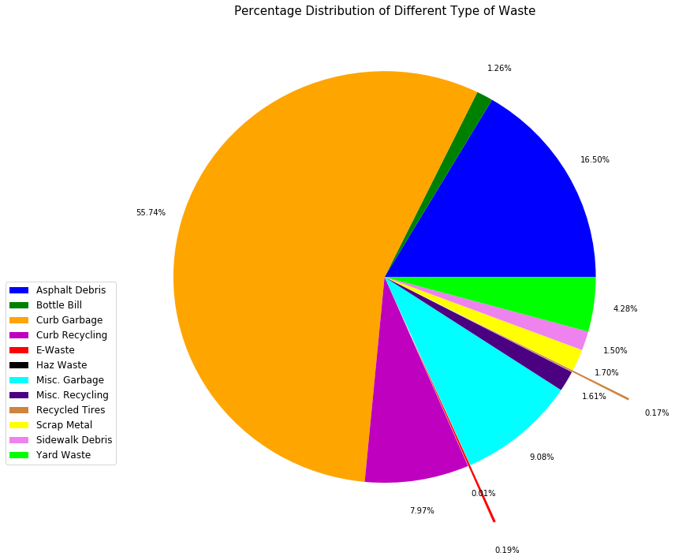
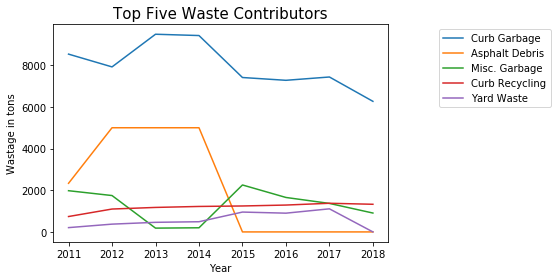

# Buffalo Landfill Waste Data

Authors:  **Harsh Patel** and **Shrinivas Phatale**

---

## Introduction
- Buffalo’s waste reduction pledge and recycling initiatives inspired us to study Buffalo’s waste management system and present the current scenario.
- The API dataset is taken from NYC open data source provided by Socrata.
https://dev.socrata.com/foundry/data.buffalony.gov/5b4n-rmfi
- The dataset we are using is a monthly breakdown of the amount of tonnage diverted from the landfill in the City of Buffalo.
- The dataset contains 12 different materials that are diverted from landfills in different ways, including curbside recycling, electronics recycling, hazardous waste disposal, tire recycling, scrap metal recycling, yard waste recycling, and asphalt and sidewalk debris diversion.It contains four columns and one hundered thirty two rows.
- The data is created on 09-07-2017 and it was last updated on 03-13-2018 and it is updated monthly.


---

## Sources
- Recycling initiatives report presented in 2017:
https://www.city-buffalo.com/files/New%20Site%20Images%20Aug%202016/Home%20Page/2017RecyclingReport.pdf
- Current system of waste management of Buffalo and future goals: http://www.ci.buffalo.ny.us/files/1_2_1/buffalogogreen/earthday2010/templates/buffalogoesgreen/WasteRecycle.html
- The source code came from Socrata API: https://dev.socrata.com/foundry/data.buffalony.gov/5b4n-rmfi
- The code extracts data from Government of Buffalo’s website: https://data.buffalony.gov/
- For plotting pie chart and line graph, we took help from matplotlib documents’ help:
Pie Chart: https://matplotlib.org/api/_as_gen/matplotlib.pyplot.pie.html
Line Graph: https://matplotlib.org/api/_as_gen/matplotlib.pyplot.plot.html
- Reference sources for coding:
Pandas: https://pandas.pydata.org/pandas-docs/stable/api.html
General Commands: https://stackoverflow.com


---

## Explanation of the Code

The code, `Buffalo_Landfill_Waste_Data.py`, begins by importing necessary Python packages:

### Import and Installation of Packages
- Procedure for installing Pandas and Sodapy
	- Open terminal window
	- Write ‘pip install pandas’ and press enter 
	- Write ‘pip install sodapy’ and press enter

- Import python packages
```
import pandas as pd
from sodapy import Socrata
import matplotlib.pyplot as plt

```

### Import data

- API data is imported from Socrata API:
```
client = Socrata ("data.buffalony.gov", None)
results = client.get("5b4n-rmfi", limit=2000)
```
- We print the results to verify what we’ve imported:
```
print results
```

### Conversion of data to Pandas dataframe:
```
results_df = pd.DataFrame.from_records(results)
```

### Re-structuring of Data
- As we decided to present this data in yearly format, we removed month column from the dataframe:
```
results_df= results_df.drop(['month'], axis=1)
```
- To get dates in year format(YYYY), we created a subset of dataframe by removing columns for type and total in tons and converted date to numeric format, and removed duplicate dates to get only one data point for each year:
```
Results_df1= results_df.drop(['type'],axis=1)
Results_df1= Results_df1.drop(['total_in_tons'],axis=1)
Results_df1['date'] = pd.to_datetime(Results_df1['date']).apply(lambda x:x.strftime('%Y'))
Results_df1['date'] = Results_df1['date'].apply(pd.to_numeric)
date= Results_df1.drop_duplicates(['date'])
```

- To create pivot table with index “type” and pivot value “total in tons”, we created a subset and dropped column of date. Then converted “total in tons” to numeric value. Finally, we applied pandas pivot table function on the newly created subset:
``` 
results_df2 = results_df.drop(['date'], axis=1)
results_df2['total_in_tons'] = results_df2['total_in_tons'].apply(pd.to_numeric)
pivot_pie = pd.pivot_table(results_df2,index=['type'])
```
- Formed a dataframe containing type of waste and “total in tons” in terms of percentage from “pivot_pie” and reset the index to obtain “type” column:
```
values = ( pivot_pie['total_in_tons'] )
total= (sum(values))
val = ((values/total)*100.0)
val = val.reindex(pivot_pie['total_in_tons'].sort_values(ascending=False).index)
val = val.reset_index()
```
- To plot the legend for pie chart, we created another subset “x” by dropping duplicates of “type” and sorting it in alphabetical order:
```
x = results_df.drop_duplicates(['type'])
x = x.sort_values('type') 
```


### Data Visualization 

### Pie Chart

- Plotted pie chart for pivot table data “pivot_pie”. For better visualization, we used plt functions for figure size, Pie Chart, font size, legend, title, saving figure and show. Also used, other pie chart functions like explode and color for the same:
```
plt.figure(figsize=(12,12))
explode = (0,0,0,0,.3,0,0,0,0.3,0,0,0)
color = ('b','g','orange','m','r','k','cyan','indigo','peru','yellow','violet','lime')
plt.pie(pivot_pie['total_in_tons'],  autopct='%.2f%%', explode= explode, pctdistance = 1.15, colors= color)
plt.rcParams['font.size']=10
plt.legend(labels = x['type'], loc='left',bbox_to_anchor=(0,0.5), prop={'size':12})
plt. title ('Percentage Distribution of Different Type of Waste', fontsize = 15)
plt.savefig('Percentage_Distribution_of_Different_Type_of_Waste.pdf', bbox_inches ='tight')
plt.show()
```

The output from this code is shown below:



### Line Graph for Top Five Contributors

- To plot the line graph for the top five waste contributors, used the following for loop. For better visualization, we used plt functions x label, y label, legend, title, save figure and show. 
- We are getting top five contributor from dataframe "val" which we have generated in the segment "re-structuring of data".
- In "val" dataframe we have sorted the countributor in the decending order of there percentage contribution.
```
z=0
for i in range(0,5):
    waste_type = results_df[results_df['type'] == val['type'][i]]
    waste_type = waste_type.drop(['type'], axis=1)
    waste_type['date'] = pd.to_datetime(waste_type['date']).apply(lambda x:x.strftime('%Y'))
    waste_type['total_in_tons'] = waste_type['total_in_tons'].apply(pd.to_numeric)
    pivot1 = pd.pivot_table(waste_type,index=['date'])    
    plt.xlabel ('Year')
    plt.ylabel ('Wastage in tons')
    plt.title ('Top Five Waste Contributors', fontsize=15)
    plt.plot(date['date'],pivot1, label = val['type'][i])
    plt.legend(loc='left',bbox_to_anchor=(1.5,1))
    i=z+1
    plt.savefig('Top_Five_Waste_Contributors.pdf',bbox_inches ='tight')
plt.show()    
```
The output from this code is shown below:




---

## How to Run the Code
To run code from the terminal window, follow these instructions:
1. Open a terminal window.

2. Change directories to where `Buffalo_Landfill_Waste_Data.py` is saved.

3. Type the following command:
	```
	python Buffalo_Landfill_Waste_Data.py
	```
4. Change the number of data points you want to analyse.

---

## Suggestions
- Instead of yearly distibution, one can keep the dataframe in monthly distribution to get more detailed view of each waste type for a short time horizon.
- We can also generate the forecast using different forecasting methods for the type of waste diverted from landfill.
- With this data and the data available on the source site, one can plot areas on the  map of the Buffalo showing which place is contributing the most to which type of waste.
